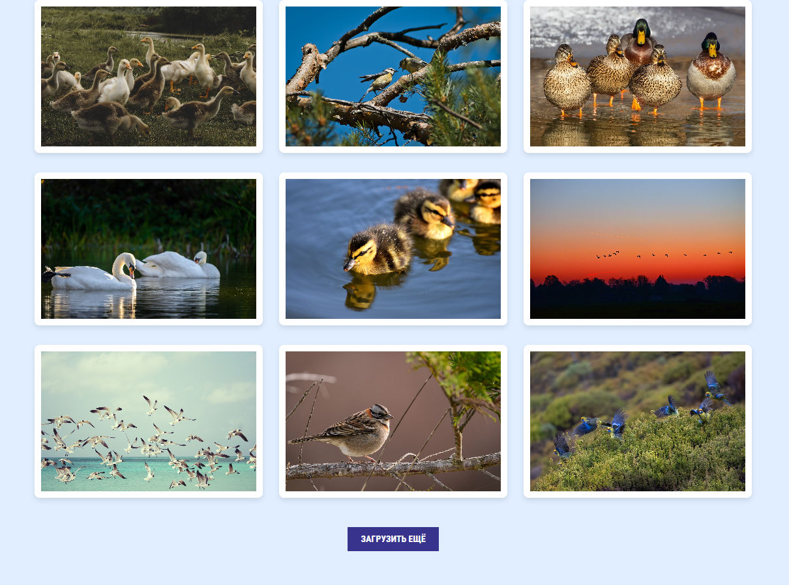
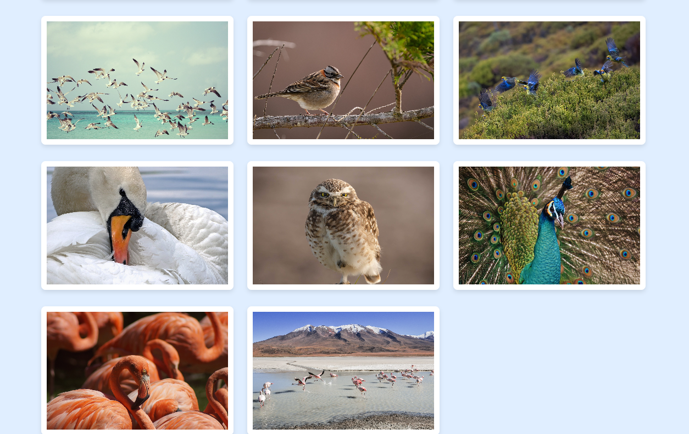
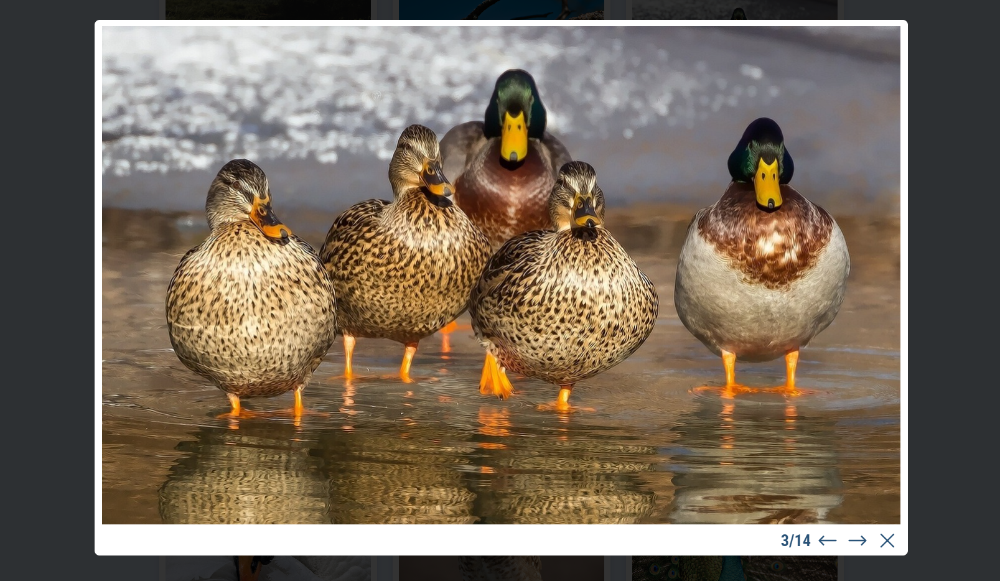

#  PhotoGalleryApp
Админка Directus (доступна по ссылке localhost:8055)

Логин: tvtugova1511@gmail.com

Пароль: t35tpa55

## Описание проекта
Данное приложение представляет собой фотогалерею, в которую администраторы сайта могут загружать фотографии, а посетители - просматривать их. 

Проект построен на React с использованием MobX для управления состоянием. Задейстованы функциональные компоненты, в целях оптимизации создан собственный хук. Backend-часть реализована с помощью Directus.

Из дополнительных требований выполнены пункты 1, 2, 4, 6, 9. Переключение фото по стрелкам реализовано внутри общего списка фото, отображенных на странице. 

## Функционал:
- Просмотр фото в увеличенном размере
- Переключение между фотографиями внутри всплывающего окна
- Поддержка пагинации
- Адаптивный интерфейс

## Установка и запуск проекта:

- Клонировать репозиторий:
```bash
git clone https://github.com/tv-tugova/PhotoGalleryApp.git
```

- Скачать Docker

- Выполнить запуск контейнеров, описанных в файле docker-compose.yml:
```bash
docker-compose up --build
```

## Скриншоты:





